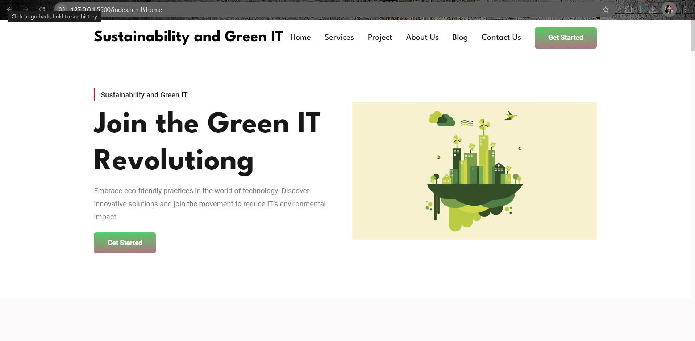
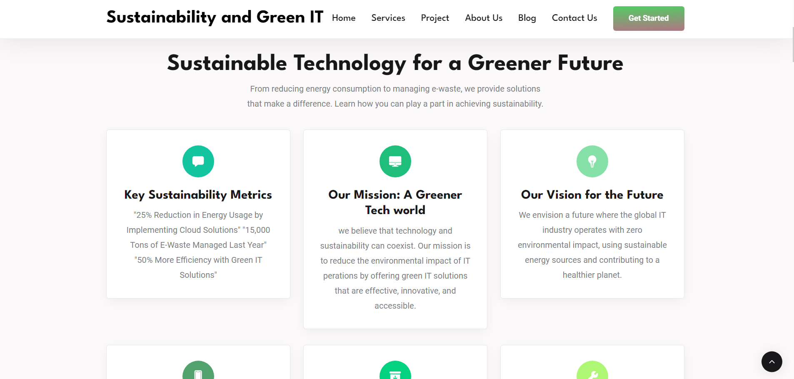
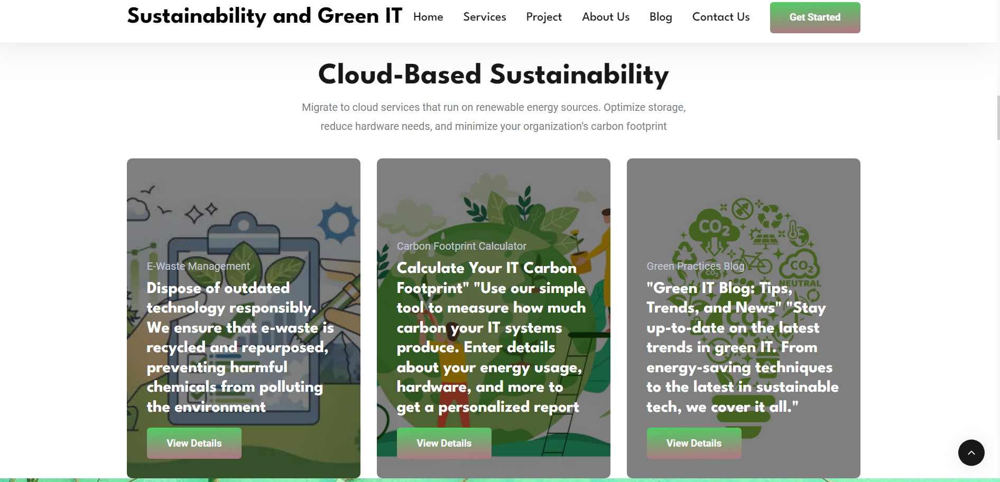
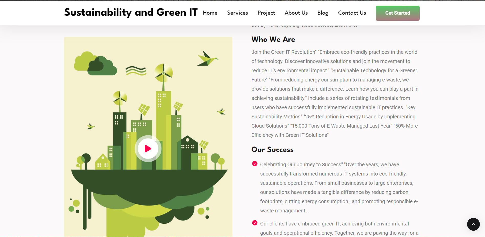
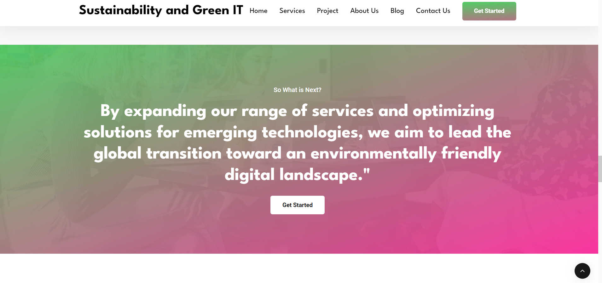
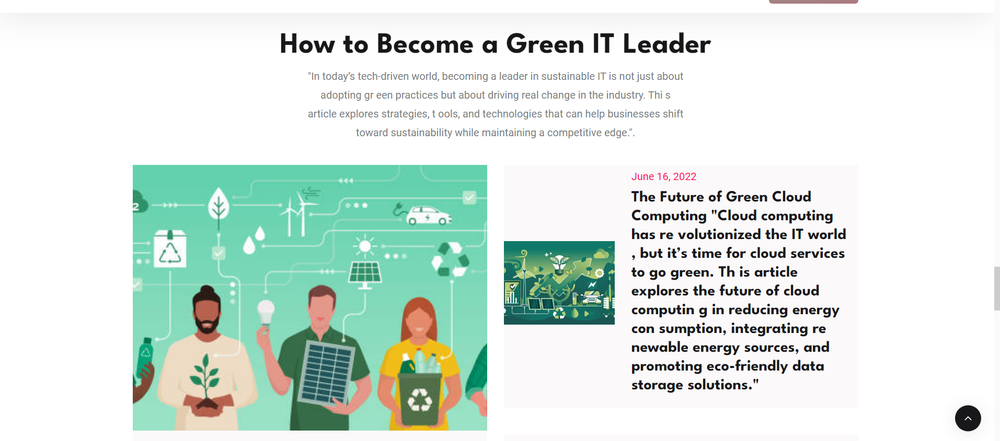
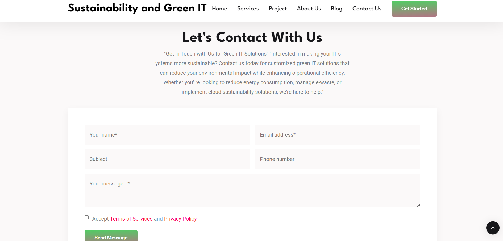

#Sustainability and Green IT Website
Welcome to the Sustainability and Green IT website! This platform is designed to promote green IT practices, offer sustainable tech solutions, and educate businesses on reducing their environmental impact through technology.

Table of Contents
Overview
Features
Technologies Used
How to Run the Project
Modules and Screenshots
Contributing
License
Overview
The website serves as an educational and solution-oriented platform focused on integrating sustainability into the IT world. It showcases the importance of reducing carbon footprints, e-waste management, energy-efficient computing, and green cloud solutions.

Features
Interactive homepage with a call-to-action and statistics.
Green IT Solutions Module with detailed service information.
Carbon Footprint Calculator to help users assess their IT impact.
Sustainability Blog with articles and tips on green IT practices.
Eco-friendly Products Store to promote sustainable tech products.
User Dashboard for tracking sustainability progress.
Contact Us Module with Google Maps integration.
Technologies Used
Frontend:

HTML5
CSS3
Bootstrap 5
JavaScript (for interactivity and animations)
Backend:

Flask (Python-based web framework)
Jinja2 templating engine
Database:

SQLite / MySQL (as needed)
How to Run the Project
Clone the repository:

bash
Copy code
cd sustainability-green-it-website
Create a virtual environment:

bash
Copy code
python3 -m venv venv
Activate the virtual environment:

On macOS/Linux:

bash
Copy code
source venv/bin/activate
On Windows:

bash
Copy code
venv\Scripts\activate
Install the dependencies:

bash
Copy code
pip install -r requirements.txt
Run the Flask server:

bash
Copy code
flask run
Open your web browser and visit http://127.0.0.1:5000 to view the website.

## Modules and Screenshots

### 1. Homepage
The homepage introduces users to sustainability efforts and key statistics about the environmental impact of IT systems.

---

### 2. About Us
Provides information about the mission, vision, and goals related to green IT and sustainability.

---

### 3. Green IT Solutions
Showcases the various solutions offered, including energy-efficient computing, cloud solutions, and e-waste management.

---

### 4. Carbon Footprint Calculator
Allows users to input data and calculate their IT carbon footprint, offering real-time tips for improvement.

---

### 5. Green Practices Blog
Features educational content and articles about green IT practices and success stories.

---

### 6. Eco-friendly Products Store
Displays a wide range of eco-friendly tech products with filtering and purchase options.

---

### 7. Sustainability Tracker
Helps users visualize and track their sustainability progress, including energy savings and carbon reduction.

---

### 8. Contact Us
Allows users to easily get in touch and ask about green IT solutions, integrated with Google Maps for easy location finding.

1. Homepage
The homepage introduces users to sustainability efforts and key statistics about the environmental impact of IT systems.

2. About Us
Provides information about the mission, vision, and goals related to green IT and sustainability.

3. Green IT Solutions
Showcases the various solutions offered, including energy-efficient computing, cloud solutions, and e-waste management.

4. Carbon Footprint Calculator
Allows users to input data and calculate their IT carbon footprint, offering real-time tips for improvement.

5. Green Practices Blog
Features educational content and articles about green IT practices and success stories.

6. Eco-friendly Products Store
Displays a wide range of eco-friendly tech products with filtering and purchase options.

7. Sustainability Tracker
Helps users visualize and track their sustainability progress, including energy savings and carbon reduction.

8. Contact Us
Allows users to easily get in touch and ask about green IT solutions, integrated with Google Maps for easy location finding.

Contributing
We welcome contributions to enhance this project! Please follow these steps to contribute:

Fork the repository.
Create a new branch: git checkout -b feature-name
Make your changes and commit: git commit -m 'Add feature'
Push to the branch: git push origin feature-name
Create a pull request.
License
This project is licensed under the MIT License. See the LICENSE file for more details.

Feel free to update this README as necessary to reflect any changes in your project or modules. Replace the image paths (static/img/p1.png to p8.png) with your actual screenshot paths when you have them ready.
